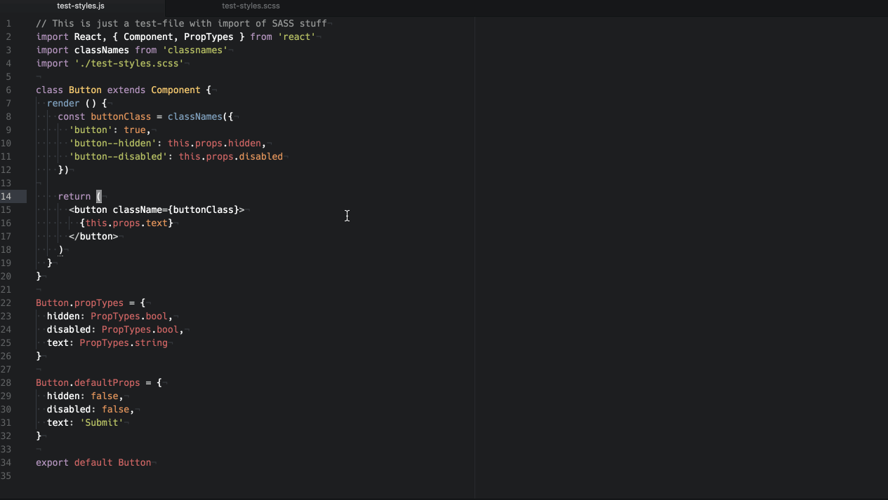

# Atom React Preview - [Github](https://github.com/VictorBjelkholm/atom-react-preview) - [Atom.io](https://atom.io/packages/atom-react-preview)

Preview your React components directly in Atom. Works best for stateless components.



## Features:

* Reload your component on save
* Editing the props in the preview area
* Saving the edits for when you reload your component again
* Supports LESS currently (feel free to submit PR with LESS/PostCSS support)

Like hot reloading, but within Atom!

## Known issues:

* Doesn't load correctly when reloading window (opening/closing the panel solves this problem) ([Issue #3](https://github.com/VictorBjelkholm/atom-react-preview/issues/3))
* The codebase is a mess, based on atom-html-preview and only got time for minor refactoring atm, will get to that ([Issue #4](https://github.com/VictorBjelkholm/atom-react-preview/issues/4))

## Install:

### apm

```bash
apm install atom-react-preview
```

### Inside Atom:

Go to "Install Packages" and search for atom-react-preview

## Toggle React Preview ##

Press `CTRL-SHIFT-M` in the editor to open the preview pane.

## Thanks

Thanks to https://github.com/webBoxio/atom-html-preview which 90% of the code is coming from. It got me to understand how Atom packages works and served as a base for this package. Thanks @webBoxio!
